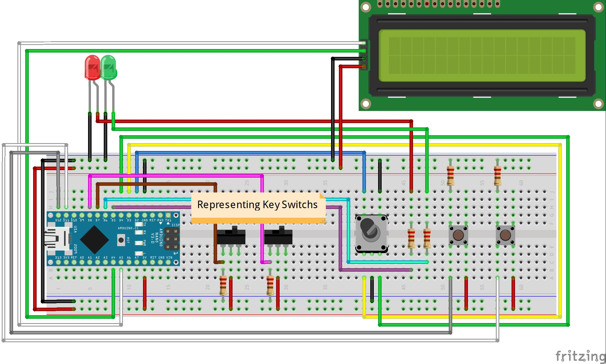

# Digital Safe Interaction

The Digital Safe Interaction is a mini game that was developed for my Master Thesis "Developing a Support Infrastructure for an Escape The Room and Peddy Paper Games".

This mini game, or interaction as I so call it, was developed to be part of an Escape the Room game that was also developed as part of my thesis. Since this interaction can work as a standalone mini game I decided to place it here for anyone interested in using it.

## List of Components

- Display LCD 16x2 1602 I2C IIC (1x);
- Red LED (1x);
- Green LED (1x);
- 220Ω Resistor (6x);
- Key Switch (2x);
- EC11 Rotary Encoder (1x);
- Button (2x);
- Arduino Nano (1x);

In order to fully assemble the Interaction, so as to look like the picture below, you will also need to 3D Print the enclosure which is divided into two parts that can be found [here](enclosure/). Additionally, you will also need to 3D Print the knob which was not designed by me but can be found in [Thingiverse](https://www.thingiverse.com/thing:2970774/files).

## The Purpose of The Game

The Digital Safe Interaction is a classic break the safe type of mini game where the player must try and guess the secret combination to open the safe door and get the contents inside. This game can work one of two ways, the way it was designed to be played was that the players would obtain pieces of the secret code by solving other interactions in the context of the Escape The Room. The other way this game can be played which was also considered for the Escape The Room is by adding a small piezzo speaker/buzzer that very faintly plays a sound when the person goes through the correct number for each of the numbers (The code is a set of three numbers)

## Instructions

First start by uploading the code to your Arduino Nano (This is the one I used so I can only guarantee proper working with this micro-controller).

### Starting the Game

To start the game you must first type in the Arduino IDE serial monitor the following:

- > COM:START;ID:123456789

This command will then print in the Serial Monitor the solution of the game which then needs to be introduced using the keypad. If the introduced code is correct then the following message will appear in the serial monitor:

- > COM:INTERACTION_SOLVED;MSG:User Discovered Combination;PNT:3000

## Warning

The source code for this interaction contains a lot of logic that was made to communicate with the infrastructure that was developed for my thesis and therefor it is not as clean as it could be when compared to a mini game that is developed with the intent of being used by the Arduino IDE directly.